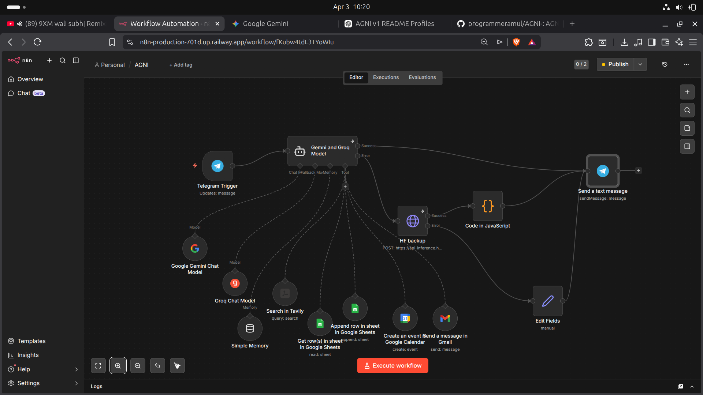

# 🔥 AGNI v1 – Automated General Neural Intelligence

**AGNI v1 is a modular AI automation system that connects user input, multi-model reasoning, memory, and external tools into a single workflow.**  
It turns messages (e.g., from Telegram) into intelligent, context-aware actions and responses.

---

## 🚀 What problem this solves

Most AI demos stop at chat. AGNI goes further:
- Takes real input (Telegram)
- Decides what to do (multi-model reasoning)
- Uses tools (Sheets, Gmail, Calendar)
- Returns results automatically

Result: **an AI that doesn’t just answer — it acts.**

---

## 🧠 How it works (at a glance)

1. **Input Layer** – Telegram message triggers the system  
2. **AI Engine** – Gemini + Groq handle reasoning  
3. **Memory Layer** – Stores context for better responses  
4. **Tool Layer** – Executes actions (Sheets, Gmail, Calendar, Search)  
5. **Fallback** – Hugging Face backup if needed  
6. **Output Layer** – Sends response back to Telegram  

---

## 📸 Workflow Architecture

AGNI integrates multi-model AI reasoning, memory, and automation tools into a unified pipeline.

---

## 📲 Live Interaction (Telegram)

AGNI responding in real time to user queries via Telegram, demonstrating context-aware AI + automation.

---

## 🧩 Key Features

- Multi-model AI (Gemini + Groq)
- Real-time interaction via Telegram
- Memory-enabled responses
- Tool execution (Google Sheets, Gmail, Calendar)
- Search integration (Tavily)
- Fallback reliability (Hugging Face)
- Modular and extensible design

---

## 🛠️ Tech Stack

- **Automation:** n8n  
- **AI Models:** Gemini, Groq  
- **Integrations:** Google Sheets, Gmail, Calendar  
- **Search:** Tavily  
- **Fallback:** Hugging Face API  

---

## 📂 Project Structure
